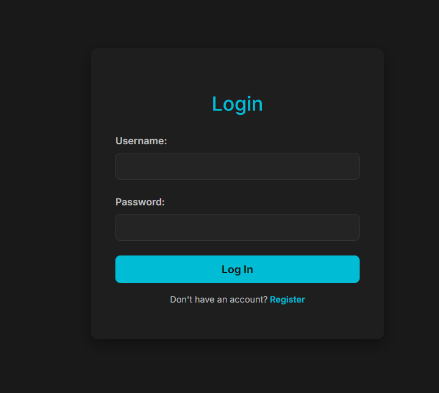

# 🤖 Anime Tracker

A full-stack Anime Tracking web application that helps users discover, organize, and manage their favorite anime. The application provides authentication, personalized watchlists, ratings, comments, polls, and an admin dashboard for content management.

---

## 🚀 Features

- 🔐 User Authentication & Authorization
- 👤 User Profiles
- ❤️ Personal Anime Watchlist
- ⭐ Ratings & Reviews
- 💬 Comments
- 📊 Polls
- 🔍 Search Anime
- 🎯 Advanced Filtering
- 👑 Admin Dashboard
- 🌙 Dark / Light Theme
- 📱 Responsive Design

---

## 🛠 Tech Stack

### Frontend
- React.js
- Vite
- CSS

### Backend
- Node.js
- Express.js

### Database
- PostgreSQL

### Tools
- Git
- GitHub
- Postman

---

## 📂 Project Structure

```text
anime-tracker/
│
├── src/
├── server/
├── public/
├── README.md
└── package.json
```

---

## ⚙️ Installation

### Clone Repository

```bash
git clone https://github.com/Smasher-Lab/anime-tracker.git
```

### Install Frontend

```bash
npm install
```

### Install Backend

```bash
cd server
npm install
```

### Run Frontend

```bash
npm run dev
```

### Run Backend

```bash
cd server
npm start
```

---

## 📸 Screenshots




---

## 🌐 Live Demo

Coming Soon

---

## 🔮 Future Improvements

- Anime Recommendation System
- Email Verification
- Notifications
- Docker Deployment
- CI/CD Pipeline
- AI Recommendations
- Watch History
- Mobile Optimization

---

## 👨‍💻 Author

**Mukku Lalith**

GitHub: https://github.com/Smasher-Lab